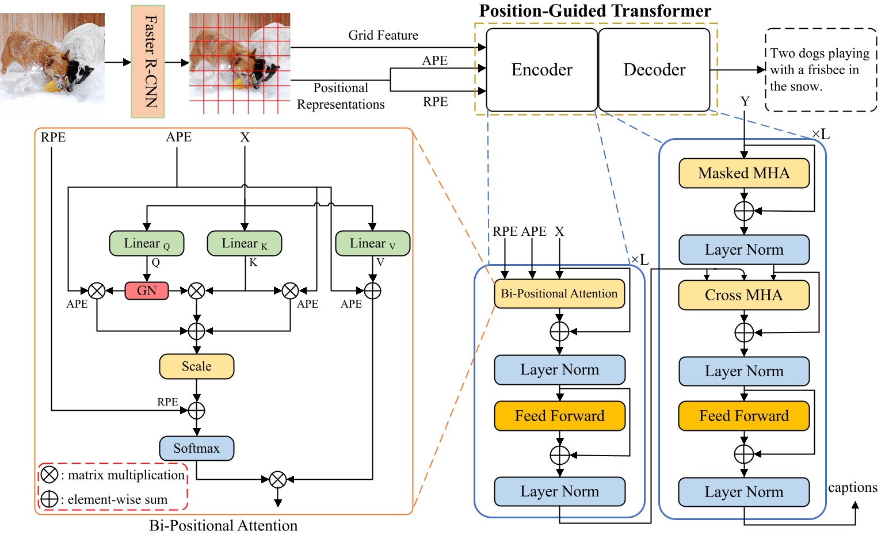

# Position-Guided Transformer for Image Captioning
This repository contains the reference code for the paper _[Position-Guided Transformer for Image Captioning]

<p align="center">
  
</p>

## Environment setup
Clone the repository and create the `m2release` conda environment using the `environment.yml` file:
```
conda env create -f environment.yml
conda activate m2release
```

Then download spacy data by executing the following command:
```
python -m spacy download en
```

Note: Python 3.6 is required to run our code. 


## Data preparation
To run the code, annotations and visual features for the COCO dataset are needed.  

First, most annotations have been prepared by [1], please download [annotations.zip](https://drive.google.com/file/d/1i8mqKFKhqvBr8kEp3DbIh9-9UNAfKGmE/view?usp=sharing) and rename the extracted folder as annotations, please download [image_info_test2014.json](http://images.cocodataset.org/annotations/image_info_test2014.zip) and put it into annotations. 

Then, visual features are computed with the code provided by [2]. To reproduce our result, please download the COCO features file in [trainval](https://pan.baidu.com/s/1s4B7JCrIk7CrQoFx5WOgjQ) and extract it as X101_grid_feats_coco_trainval.hdf5. Acess code:bnvu


## Evaluation
To reproduce the results reported in our paper, download the pretrained model file [meshed_memory_transformer.pth](https://drive.google.com/file/d/1naUSnVqXSMIdoiNz_fjqKwh9tXF7x8Nx/view?usp=sharing) and place it in the code folder.

Run `python test.py` using the following arguments:

| Argument | Possible values |
|------|------|
| `--batch_size` | Batch size (default: 10) |
| `--workers` | Number of workers (default: 0) |
| `--features_path` | Path to detection features file |
| `--annotation_folder` | Path to folder with COCO annotations |

#### Expected output
Under `output_logs/`, you may also find the expected output of the evaluation code.


## Training procedure
Run `python train.py` using the following arguments:

| Argument | Possible values |
|------|------|
| `--exp_name` | Experiment name|
| `--batch_size` | Batch size (default: 10) |
| `--workers` | Number of workers (default: 0) |
| `--m` | Number of memory vectors (default: 40) |
| `--head` | Number of heads (default: 8) |
| `--warmup` | Warmup value for learning rate scheduling (default: 10000) |
| `--resume_last` | If used, the training will be resumed from the last checkpoint. |
| `--resume_best` | If used, the training will be resumed from the best checkpoint. |
| `--features_path` | Path to detection features file |
| `--annotation_folder` | Path to folder with COCO annotations |
| `--logs_folder` | Path folder for tensorboard logs (default: "tensorboard_logs")|

For example, to train our model with the parameters used in our experiments, use
```
python train.py --exp_name m2_transformer --batch_size 50 --m 40 --head 8 --warmup 10000 --features_path /path/to/features --annotation_folder /path/to/annotations
```

#### References
[1] P. Anderson, X. He, C. Buehler, D. Teney, M. Johnson, S. Gould, and L. Zhang. Bottom-up and top-down attention for image captioning and visual question answering. In _Proceedings of the IEEE Conference on Computer Vision and Pattern Recognition_, 2018.
